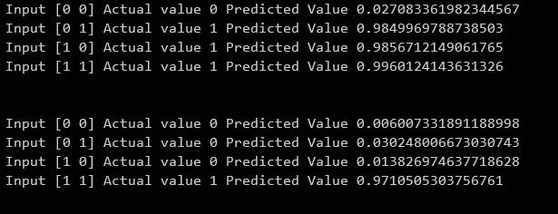

# Neural Network for "and" and "or" function
*  This Repository contains Source Code of Neural network for "and" and "or" function .It is written from scratch in pyhton and use only numpy for matrix calculations .

## Example Output 

